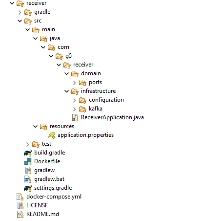

# Consumidor de Mensajería - Apache Kafka

### Descripción

Este servicio actuará como consumidor de los mensajes generados en la arquitectura de Apache Kafka.

Básicamente Kafka tiene la función de recibir y procesar mensajes provenientes de un topic, esto permite la gestión y análisis de eventos mediante mensajes en tiempo real.

### Requisitos previos

Antes de ejecutar el consumidor, asegúrate de contar con los siguientes requisitos:

```
Apache Kafka en ejecución
Java 22 instalado
Gradle instalado
Docker instalado
```

Para verificar las versiones instaladas, ejecutar los siguientes comandos:

```
java -version
gradle -version
docker --version
```

### Arquitectura del proyecto

Para este proyecto usamos la arquitectura hexagonal, también conocida como arquitectura de puertos y adaptadores, es un patrón de diseño de software que busca separar la lógica de negocio central de una aplicación de las dependencias externas. Esto permite que la aplicación sea más flexible, mantenible y fácil de probar.

Gráficamente veremos el proyecto de la siguiente manera:



### Instalación y Ejecución

1. Compilación del Proyecto

El proyecto está construído para ser desplegado haciendo uso de la herramienta Docker, para eso hemos creado el archivo Dockerfile, el mismo que permitirá construir la imagen y posteriormente el contenedor:

```
docker build -t consumer .
```

2. Ejecución del Consumidor

```
docker run -p 8070:8070 consumer
```

### Consumo de mensajes

El consumidor se suscribe a un topic específico de Kafka, recibiendo y procesando los mensajes entrantes. 

Para verificar la correcta recepción y procesamiento de los mensajes, se pueden utilizar la siguiente estrategia: Monitoreo de registros (logs) del consumidor con esto podemos visuales los mensajes en tiempo real, para eso usamos el siguiente comando de docker:

```
docker logs -f kafka-consumer
```

### Casos de uso principales

- Procesamiento de Eventos en Tiempo Real: Facilita la ingesta y el análisis continuo de flujos de datos, permitiendo la automatización de respuestas inmediatas y la toma de decisiones basada en información actualizada que puede tener cada uno de los mensajes.
- Monitoreo de Transacciones en Arquitecturas de Microservicios: Permite el seguimiento y la auditoría de transacciones distribuidas, asegurando la integridad y la coherencia del estado del sistema en tiempo real.

### Consideraciones sobre la elección de Tecnología: Kafka vs RabbitMQ

La elección entre Kafka y RabbitMQ depende de los requisitos específicos de la aplicación:

- *** Kafka ***: Se destaca en escenarios que requieren el procesamiento de grandes volúmenes de datos históricos y la capacidad de escalar horizontalmente. Su modelo de topic y particiones permite la relectura de eventos y el procesamiento distribuido.
- *** RabbitMQ ***: Es ideal para aplicaciones que priorizan la entrega inmediata de mensajes y el enrutamiento flexible. Su modelo de colas facilita la implementación de patrones de mensajería complejos.

En resumen, Kafka es preferible para aplicaciones que demandan alta capacidad de procesamiento y almacenamiento de eventos, mientras que *** RabbitMQ *** se adapta mejor a sistemas que requieren baja latencia y enrutamiento avanzado.

### Conclusión

Este consumidor de Kafka proporciona una solución robusta y escalable para la ingesta y el procesamiento de eventos en tiempo real. 

Lo que lo convierte en una pieza fundamental para arquitecturas basadas en eventos que requieren alta disponibilidad y rendimiento.