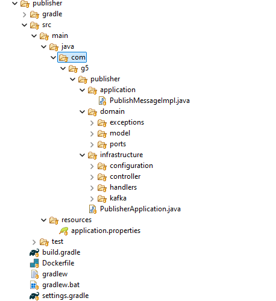

# Productor - Apache Kafka

### Descripción

La funcionalidad principal del productor en Kafka es producir mensajes en tiempo real, con la finalidad de que sean consumidos por otras aplicaciones. Este tipo de funcionalida permite la integración de diferentes sistemas que necesitan interactuar con diferente propósitos.

### Requisitos previos

Para ejecutar el productor, debemos reunir los requisitos:

```
Apache Kafka en ejecución
Java 22 instalado
Gradle instalado
Docker instalado
```

Puedes verificar las versiones con:

```
java -version
gradle -version
docker --version
```

### Instalación y Ejecución

1. Compilación del Proyecto

El proyecto está construído para ser desplegado haciendo uso de la herramienta Docker, para eso hemos creado el archivo Dockerfile, el mismo que permitirá construir la imagen y posteriormente el contenedor:

```
docker build -t producer .
```

2. Ejecución del Productor

```
docker run -p 8090:8090 producer
```

3. Publicación de Mensajes

El productor envía mensajes a un topic específico de Kafka. Se puede usar peticiones HTTP con la finalidad de realizar pruebas de ejecución.

### Arquitectura del proyecto

Para este proyecto usamos la arquitectura hexagonal, también conocida como arquitectura de puertos y adaptadores, es un patrón de diseño de software que busca separar la lógica de negocio central de una aplicación de las dependencias externas. Esto permite que la aplicación sea más flexible, mantenible y fácil de probar.

Gráficamente veremos el proyecto de la siguiente manera:



### Casos de Uso

*** Transmisión de eventos en tiempo real ***: Permite el envío continuo de datos a través de Kafka, garantizando que los consumidores procesen los mensajes en el orden recibido sin pérdida de información clave. Es ideal para aplicaciones que requieren eventos secuenciales, como monitoreo de sistemas y análisis en tiempo real.

*** Integración con sistemas distribuidos ***: Facilita la comunicación entre microservicios al permitir que múltiples aplicaciones se suscriban y reaccionen a eventos en distintos puntos de una arquitectura distribuida. Esto mejora la escalabilidad y minimiza la dependencia entre servicios.

*** Publicación de logs y métricas en microservicios ***: Permite almacenar y analizar registros en tiempo real, asegurando que los eventos de diferentes servicios se capturen de forma ordenada. Esto es esencial para el monitoreo en entornos de producción, la detección de errores y el análisis de rendimiento.

### Comparación con RabbitMQ

Kafka y RabbitMQ tienen enfoques distintos en la producción y distribución de mensajes:

*** Kafka ***

El productor envía mensajes a un topic, donde se almacenan de forma persistente y se consumen en el orden en que fueron publicados. Su arquitectura está optimizada para el manejo de grandes volúmenes de datos con baja latencia y alta tolerancia a fallos. Además, Kafka permite a múltiples consumidores leer los mismos mensajes sin afectar el rendimiento, lo que lo hace ideal para el procesamiento de eventos en streaming y la analítica en tiempo real.

*** RabbitMQ ***

El productor envía mensajes a un exchange, que los distribuye a las colas según el tipo de intercambio configurado (direct, fanout, topic). RabbitMQ está diseñado para una entrega rápida y confiable de mensajes, pero no los almacena de forma persistente por defecto. Su enfoque es más adecuado para la comunicación transaccional entre servicios, donde la prioridad es la entrega inmediata de mensajes en arquitecturas de microservicios.

*** Diferencias clave ***

Mientras que Kafka está diseñado para manejar flujos de eventos a gran escala y proporciona almacenamiento distribuido con replicación, RabbitMQ se centra en la mensajería orientada a colas para la comunicación eficiente entre servicios. La elección entre ambos depende del caso de uso: Kafka es ideal para procesamiento de eventos y big data, mientras que RabbitMQ es más adecuado para mensajería empresarial y comunicación entre microservicios.

### Conclusión

Este productor Kafka permite enviar mensajes a un topic, facilitando la integración de sistemas en tiempo real mediante una arquitectura basada en eventos. Si se requiere procesamiento en tiempo real y alta disponibilidad, Kafka es la mejor opción; si el objetivo es mensajería confiable y rápida entre servicios, RabbitMQ es más adecuado. En algunos casos, incluso pueden complementarse dentro de una arquitectura híbrida.