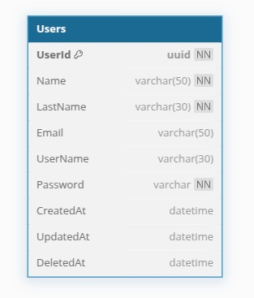

# Proyecto Final - Grupo 5

## Registro de usuario de un Wedding Planner

## Flujo de Negocio

El sistema realizará el logueo de un usuario, si el cliente no tiene un usuario se creara uno y posteriormente se enviara esa información a traves de graphql el cual enrutará el mensaje para dos distintos microservicios un REST(Producer) y un gRPC......

## Arquitectura


### Front End

#### Wedding Planner

Se esta usando *** NextJS ***, que es un framework de React optimizado para rendimiento y SEO.

#### Tecnologías utilizadas

*** React ***: Next.js se basa en React, por lo que puedes usar Hooks, Context API y componentes reutilizables.
*** Tailwind CSS o CSS Modules ***: Puedes elegir entre Tailwind CSS para estilos rápidos o CSS Modules para mantener estilos aislados.
*** State Management ***: Dependiendo de la complejidad, puedes usar Zustand, Redux, Recoil o Context API.
*** Autenticación ***: Para la autenticación se está usando Auth0.

### API Gateway + GraphQL

#### Kong:

- **Versión:** 3.0
- **Puerto Proxy:** 8000
- **Puerto Administración:** 8001

#### GraphQL:

- **Tecnología:** NestJs
- **Versión:** 16.10.0
- **Apollo Server:** 3.13.0
- **Puerto:** 4000

### Base de Datos

Para persistir la información se está usando como base de datos **_ PostgreSQL _** que es un sistema de gestión de bases de datos relacional y orientado a objetos de código abierto. Es conocido por su robustez, escalabilidad y cumplimiento con el estándar SQL. Soporta transacciones ACID, extensibilidad mediante funciones y tipos de datos personalizados, replicación, indexación avanzada y JSON para almacenamiento semiestructurado. Es utilizado en aplicaciones empresariales, analíticas y web por su alto rendimiento y flexibilidad.

La estructura de la base de datos es la siguiente:



### gRPC

- **Tecnología:** Spring
- **version:** 3.4.3
- **puerto:** 9091

### CDC (Change Data Capture)

_(Explicar cómo se maneja el CDC en el sistema)_

### Autenticación

#### Auth0

- **Tecnología:** Express
- **Versión:** 4.21.2
- **Puerto:** 3000

## Configuración y Despliegue

### 📌 Requisitos Previos

_(Software necesario, dependencias, herramientas, etc.)_

### 🚀 Pasos de Instalación

1. Clonar el repositorio:
   ```bash
   git clone https://github.com/usuario/proyectoFinal-g5.git
   ```
2. _(Agregar más pasos de configuración)_

### 📦 Despliegue

_(Instrucciones para desplegar la aplicación en producción)_
