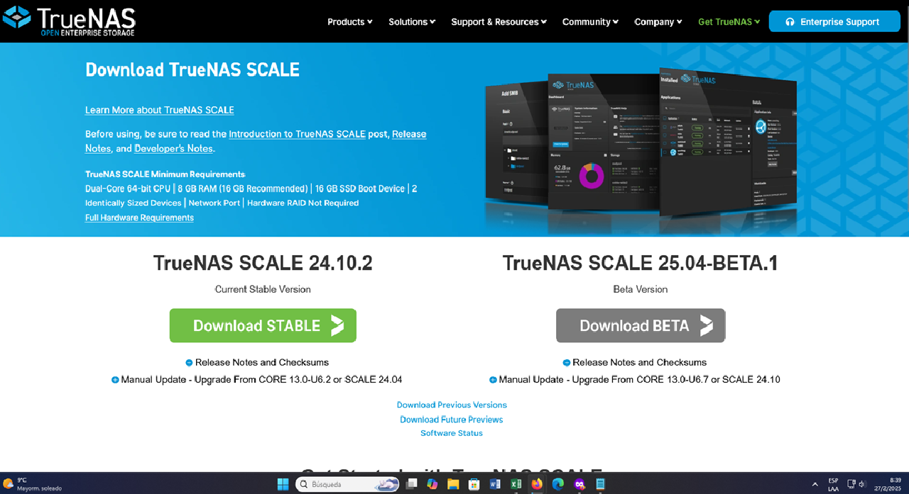

# INFORME SOBRE TRUENAS COMMUNITY EDITION Y SU APLICABILIDAD EN ENTORNOS EMPRESARIALES

## OBJETIVO GENERAL

Investigar sobre TrueNAS Community Edition y su aplicabilidad en entornos empresariales.

## OBJETIVOS ESPECÍFICOS

- Evaluar las diferencias entre la versión Community y la versión Empresarial.
- Indicar los casos de uso en la integración empresarial.
- Mencionar las ventajas y desventajas de la herramienta TrueNAS.
- Comparar TrueNAS con otras soluciones de almacenamiento.

---

## 1. ¿Qué es TrueNAS?

TrueNAS es un sistema operativo diseñado para almacenamiento en red. Es una solución de código abierto utilizada para gestionar y compartir almacenamiento en redes locales o en la nube.

El sistema operativo que usa TrueNAS depende de la versión elegida:

- **TrueNAS CORE**: Basado en FreeBSD.
- **TrueNAS SCALE**: Basado en Debian Linux.

Ambos utilizan el sistema de archivos **ZFS**, pero TrueNAS SCALE ofrece mayor compatibilidad con contenedores y Kubernetes debido a su base en Linux.

---

## 2. Características Principales

Entre las principales características de TrueNAS se encuentran:

- Manejo avanzado de archivos, permitiendo:
  - Protección contra corrupción de datos.
  - Creación de snapshots y replicación de datos.
- Almacenamiento flexible con soporte para configuraciones RAID.
- Compatibilidad con diversos protocolos de red: **SMB, NFS, FTP, SFTP**.
- Soporte para virtualización y contenedores:
  - **TrueNAS CORE** admite virtualización.
  - **TrueNAS SCALE** permite contenerización con Docker y Kubernetes.
- Alta disponibilidad y seguridad mediante cifrado de discos, replicación y backups automáticos.

---

## 3. Comparación entre TrueNAS Community y TrueNAS Enterprise

### TrueNAS Community (CORE / SCALE)
✅ Código abierto y gratuito.  
✅ Basado en FreeBSD (CORE) o Debian Linux (SCALE) con sistema de archivos ZFS.  
✅ Compatible con hardware genérico (PCs, servidores caseros).  
✅ Soporta **SMB, NFS, AFP, iSCSI, FTP**.  
✅ Permite snapshots, replicación y cifrado.  
✅ Administración a través de una interfaz web.  

### TrueNAS Enterprise
✅ Basado en TrueNAS CORE, optimizado para entornos empresariales.  
✅ Soporte técnico profesional de iXsystems.  
✅ Alta disponibilidad (**HA**) con failover automático.  
✅ Soporte para discos **SAS y NVMe** de alto rendimiento.  
✅ Integración avanzada con **VMware, Active Directory y LDAP**.  
✅ Licencia de alto rendimiento **ZFS** (RAID-Z con aceleración).  
✅ Incluye hardware certificado (**TrueNAS appliances de iXsystems**).  
⚠️ No es gratuito y requiere hardware validado por iXsystems.  

---

## 4. Casos de Uso en la Integración Empresarial

TrueNAS se puede utilizar en diversos escenarios dentro de una empresa, tales como:

- **Almacenamiento centralizado para redes corporativas**.
- **Solución NAS para backup y replicación**.
- **Virtualización de servidores con almacenamiento compartido**.
- **Almacenamiento para entornos de desarrollo y pruebas**.
- **Administración de grandes volúmenes de datos en infraestructuras de TI**.
- **Implementaciones de almacenamiento en la nube privada o híbrida**.

---

## 5. Ventajas y Desventajas de TrueNAS

### Ventajas
✅ Solución de código abierto y gratuita.  
✅ Sistema de archivos **ZFS** con alta protección contra corrupción de datos.  
✅ Interfaz web intuitiva y fácil de administrar.  
✅ Compatibilidad con múltiples protocolos de almacenamiento.  
✅ Escalabilidad con soporte para discos adicionales y configuraciones RAID.  
✅ Integración con contenedores y Kubernetes (**TrueNAS SCALE**).  

### Desventajas
⚠️ Requiere hardware compatible para un mejor desempeño.  
⚠️ La versión Community no tiene soporte técnico oficial.  
⚠️ La configuración y mantenimiento pueden requerir conocimientos técnicos avanzados.  
⚠️ La versión Enterprise tiene costos elevados.  

---

## 6. Comparación con Otras Soluciones de Almacenamiento

| Característica       | TrueNAS CORE/SCALE | TrueNAS Enterprise | Synology NAS  | QNAP NAS  | FreeNAS  |
|----------------------|-------------------|------------------|--------------|------------|---------|
| Código abierto     | Sí               | No               | No           | No         | Sí     |
| Sistema de archivos | ZFS               | ZFS              | EXT4, Btrfs  | EXT4, Btrfs | ZFS     |
| Soporte contenedores | SCALE: Sí        | No               | No           | Sí        | No      |
| Soporte HA          | No                | Sí              | Sí (en modelos avanzados) | Sí (en modelos avanzados) | No |
| Coste               | Gratuito          | Pago             | Pago         | Pago       | Gratuito |
| Hardware dedicado   | No                | Sí              | Sí          | Sí        | No      |

---

## PROCESO DE INSTALACIÓN

### 1. Página web oficial de TrueNAS

### 2. Versiones de TrueNAS

### 3. Download imagen iso de TrueNAS

### 4. Instalación en Workstation

### 5. Instalación

### 6. Instalación

### 7. Instalación

### 8. Instalación

### 9. Instalación

### 10. Instalación

### 11. Instalación

### 12. Instalación

### 13. Instalación

### 14. Instalación

### 15. Final de instalación, pantalla de autenticación

### 16. Dashboard principal de TrueNAS

### 17. Dashboard

### 18. Dashboard

### 19. Dashboard

### 20. Dashboard

### 21. Dashboard

### 22. Dashboard

### 23. Dashboard

---

## Conclusiones

- TrueNAS Community Edition es una excelente opción de almacenamiento de código abierto con grandes ventajas en entornos de pequeñas y medianas empresas.
- Para empresas que requieren alta disponibilidad y soporte técnico, TrueNAS Enterprise es una opción más robusta pero con costos asociados.
- Comparado con otras soluciones NAS comerciales como **Synology** o **QNAP**, TrueNAS destaca por su flexibilidad y su sistema de archivos **ZFS**, aunque puede ser más complejo de configurar.
- La elección entre TrueNAS CORE, SCALE o Enterprise dependerá de las necesidades específicas de la organización y del nivel de soporte requerido.
